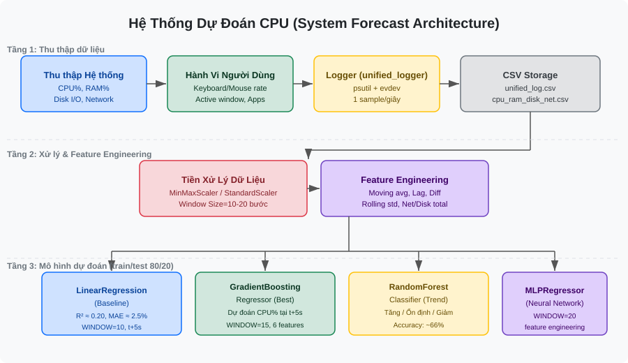

# system_forecast_do_an

Dự đoán mức sử dụng tài nguyên hệ thống (CPU) dựa trên hành vi người dùng.

## Kiến trúc hệ thống (Architecture)



## Mô hình (Models)

### Baseline
- **LinearRegression** — dự đoán CPU% tại t+5 giây dựa trên cửa sổ 10 bước thời gian gần nhất (R² ≈ 0.20)

### Cải tiến
- **MLPRegressor (Neural Network)** — kết hợp feature engineering (moving average, lag features, log transform)
- **GradientBoostingRegressor** — regression tốt nhất hiện tại (R² cải thiện đáng kể so với baseline)
- **RandomForestClassifier** — phân loại xu hướng CPU: Tăng / Ổn định / Giảm (Accuracy ≈ 66%)

### Cấu hình chung
| Tham số | Giá trị |
|---------|---------|
| `WINDOW_SIZE` | 10–20 bước (~10–20 giây) |
| `PREDICT_AHEAD` | 5 bước (~5 giây) |
| `TEST_SIZE` | 20% |
| `TARGET` | `cpu_percent` |

## Dependencies hệ thống
```
libinput-tools
```

## Python dependencies
```
psutil, pandas, numpy, scikit-learn, evdev
```
